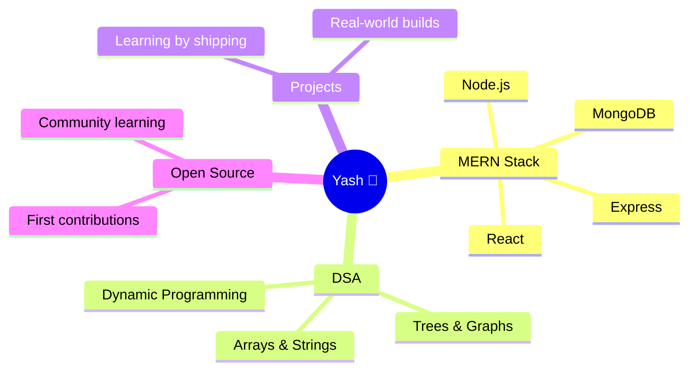

<div align="center">


</div>

<br>


### 🧑‍🚀 About Me

```javascript
const yash = {
    role: "B.Tech IT Student",
    location: "Rajasthan, India 🇮🇳",
    currentlyLearning: ["C++", "JavaScript", "MERN Stack"],
    passion: "Full Stack Development",
    dailyGrind: "Data Structures & Algorithms",
    philosophy: "Progress > Perfection",
    funFact: "My commit graph is basically my diary 📓",
    status: () => "🌱 Growing every single day"
};

yash.status(); // "🌱 Growing every single day"
```

<div align="center">

| 🌱 | 💻 | 📚 | 🚀 |
|:---:|:---:|:---:|:---:|
| Leveling up in **C++, JS & MERN** | Building **Full Stack** projects | Sharpening **DSA** daily | Shipping small wins, every day |

</div>


### 🛠 Tech Arsenal

<div align="center">


</div>


### 📌 Current Focus

<div align="center">



</div>


### 📊 GitHub Stats

<div align="center">


</div>


### 🐍 Contribution Snake

<div align="center">


<sub>⚙️ Animates automatically once the Snake GitHub Action is set up (steps below) 👇</sub>

</div>


### 🔥 Trophy Cabinet

<div align="center">


<sub>🏆 Fills up automatically as you star, commit, and grow on GitHub</sub>

</div>


<div align="center">

### 💭 Random Dev Wisdom


</div>


<div align="center">


### ✨ Starting fresh and growing every day ✨


</div>
